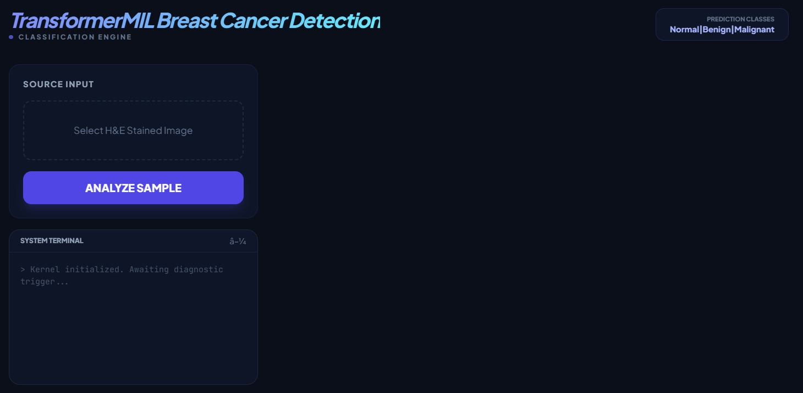
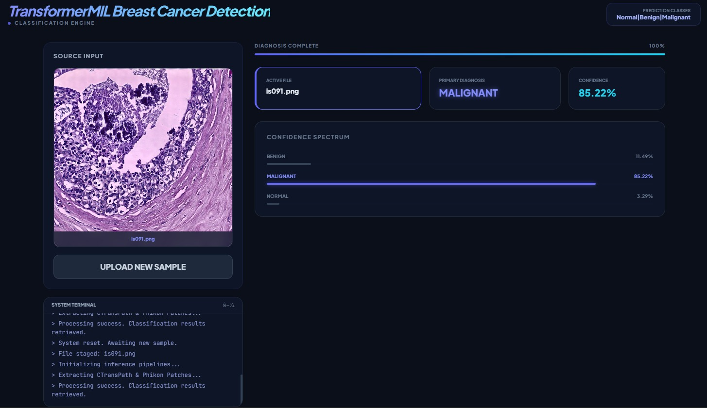

# TransformerMIL Breast Cancer Detection

Simple FastAPI app that runs a preloaded Swin + Phikon feature extractor with a 5-fold Transformer MIL ensemble to classify breast histopathology images.

## Files:
- [app.py](app.py#L1-L200): FastAPI server and model inference pipeline.
- [Ensemble](Ensemble): folder containing `brain_0.pth`..`brain_4.pth` ensemble weights.

## Requirements

### Software Requirements
Install the Python dependencies from `requirements.txt`:

```bash
python -m pip install -r requirements.txt
```

### Hardware Requirements  

This project was developed and tested using an NVIDIA RTX 3050 Ti Laptop GPU.  
All dependencies and libraries have been configured and optimized for this hardware environment.

Compatibility and performance may vary on systems with different GPU configurations, CUDA versions, or hardware specifications.

## Model files
- The app expects the 5 ensemble weights in `capstone_ensemble/brain_0.pth` ... `brain_4.pth`.
- The script also downloads or loads locally the CTransPath and Phikon weights (configured to use local cache / offline files).

## Run (development)

```bash
# run directly
python app.py

# or with uvicorn for production-like server
uvicorn app:app --host 0.0.0.0 --port 8000
```

## API
- `GET /` serves the UI from `static/index.html`.
- `POST /analyze` accepts a multipart `file` (image). Response JSON contains `prediction` and `all_scores` breakdown.

**Example curl usage:**

```bash
curl -F "file=@/path/to/image.png" http://127.0.0.1:8000/analyze
```

## Analyze Images
Access the drive link to analyze histopathology slides: 
https://drive.google.com/drive/folders/1H1mfY853Sd2rcYEIUByRnWP-wgjfWMgs?usp=sharing

## Images of the project
### Dashboard** 


### Results**
